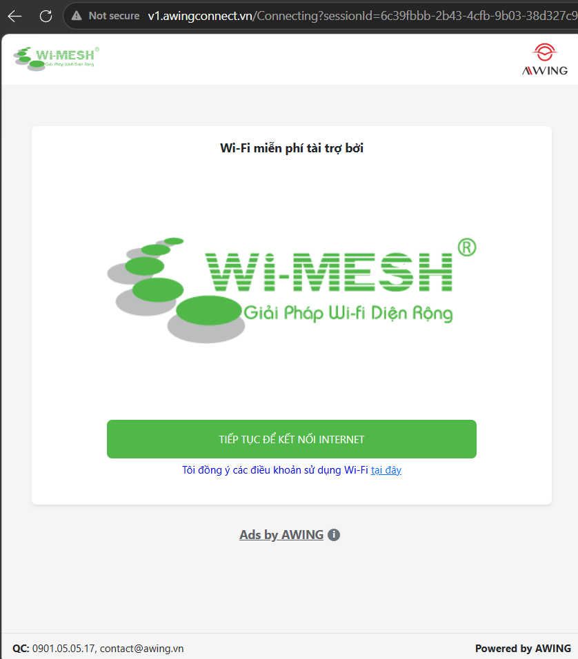

# 🚀 AWING WiFi Auto-Login (Ký túc xá / Wi-Mesh)



## 📌 Vấn đề (Problem)
Khi sử dụng mạng WiFi miễn phí tại Ký túc xá (được tài trợ bởi hệ thống AWING / Wi-Mesh / Mikrotik), người dùng thường xuyên gặp phải sự bất tiện:
- **Click phức tạp:** Mỗi lần kết nối, bạn phải chờ màn hình Captive Portal tải lên, xem quảng cáo và phải click nút *"Tiếp tục để kết nối Internet"* một cách thủ công.
- **Hết phiên (Session Timeout):** Hệ thống thường tự động ngắt kết nối (kick) sau một khoảng thời gian (30-60 phút). Bạn sẽ bị mất mạng đột ngột (đang chơi game, tải file bị gián đoạn) và phải thực hiện lại toàn bộ quá trình đăng nhập phiền phức trên.

## 💡 Giải pháp (Solution)
Dự án này là một script tự động hóa hoàn toàn bằng **Node.js** giúp bạn giải quyết triệt để vấn đề trên:
- **Bypass Captive Portal:** Tự động giả lập quá trình xem quảng cáo (Analytic View/Click) và bắt tay với Mikrotik Router để lấy Internet mà không cần mở trình duyệt.
- **Auto-Reconnect (Keep-Alive):** Treo script chạy ngầm. Hệ thống tích hợp đồng hồ đếm ngược từng giây và tự động xin cấp lại IP/Internet **trước khi** hoặc **ngay khi** phiên làm việc cũ hết hạn. Bạn sẽ có Internet 24/7 mà không lo bị ngắt quãng.
- **Force Logout & Retry:** Tự động phát hiện khi session bị kẹt và gửi lệnh force logout để làm mới kết nối.

---

## 💻 1. Hướng dẫn chạy trên Máy tính (Windows / macOS / Linux)

**Yêu cầu:** Máy tính đã cài đặt [Node.js](https://nodejs.org/).

1. Kết nối vào mạng WiFi AWING (Lúc này biểu tượng mạng sẽ có dấu chấm than báo chưa có Internet).
2. Clone repository này về máy:
   ```bash
   git clone https://github.com/tannpdev-rgb/ktx-wifi.git
   cd ktx-wifi
   ```
3. Chạy lệnh:
   ```bash
   node index.js
   ```
4. Treo cửa sổ Terminal đó (hoặc thu nhỏ lại). Script sẽ lấy Internet cho bạn và tiếp tục đếm ngược để tự động gia hạn kết nối.

---

## 📱 2. Hướng dẫn chạy trên Điện thoại Android (Sử dụng Termux)

Bạn hoàn toàn có thể treo script này trên điện thoại Android để điện thoại tự động vượt rào WiFi AWING mọi lúc mà không cần root máy.

### Yêu cầu ban đầu
Cài đặt ứng dụng **Termux** từ [F-Droid](https://f-droid.org/en/packages/com.termux/) (Lưu ý: Không tải từ Google Play vì bản đó không còn được hỗ trợ cập nhật).

### Các bước thiết lập
**Bước 1: Cài đặt Node.js và Git cho Termux**
Mở ứng dụng Termux lên và gõ:
```bash
pkg update && pkg upgrade -y
pkg install nodejs git -y
```

**Bước 2: Clone source code về điện thoại**
Gõ lệnh sau để tải code:
```bash
git clone https://github.com/tannpdev-rgb/ktx-wifi.git
cd ktx-wifi
```

**Bước 3: Chạy Script**
Gõ lệnh:
```bash
node index.js
```
Script sẽ bắt đầu chạy và đếm ngược trên điện thoại giống hệt như trên máy tính.

### 💡 Mẹo: Treo script chạy ngầm vĩnh viễn trên Android
Để tránh việc hệ điều hành Android tự động tắt Termux khi bạn thoát ứng dụng nhằm tiết kiệm pin:
1. Vào **Cài đặt (Settings)** của điện thoại -> **Ứng dụng (Apps)** -> Tìm ứng dụng **Termux**.
2. Tìm phần quản lý **Pin (Battery)** -> Chọn **Không hạn chế (Unrestricted / No Optimization)**.
3. Để script tự chạy lại sau khi khởi động máy hoặc chạy ổn định nhất, hãy cài `pm2`:
   ```bash
   npm install -g pm2
   pm2 start index.js --name ktx-wifi
   pm2 save
   ```
   Lúc này, kể cả khi bạn vuốt đóng ứng dụng Termux, script vẫn âm thầm chạy ở chế độ nền.

---

## ⚙️ Cấu hình (Configuration)
Bạn có thể mở file `index.js` bằng bất kỳ Text Editor nào để sửa đổi tần suất tự động quét mạng:
```javascript
const INTERVAL_MINUTES = 30; // Chỉnh thành 1 nếu mạng hay bị rớt bất thường
```

## ⚠️ Lưu ý
- Script yêu cầu bạn phải đang bắt sóng trực tiếp WiFi AWING thì mới có thể chạy được (nếu không script sẽ báo `Không tìm thấy wifiInfo`).
- Không đổi tên các header mặc định trong script để tránh bị máy chủ AWING chặn (block).
